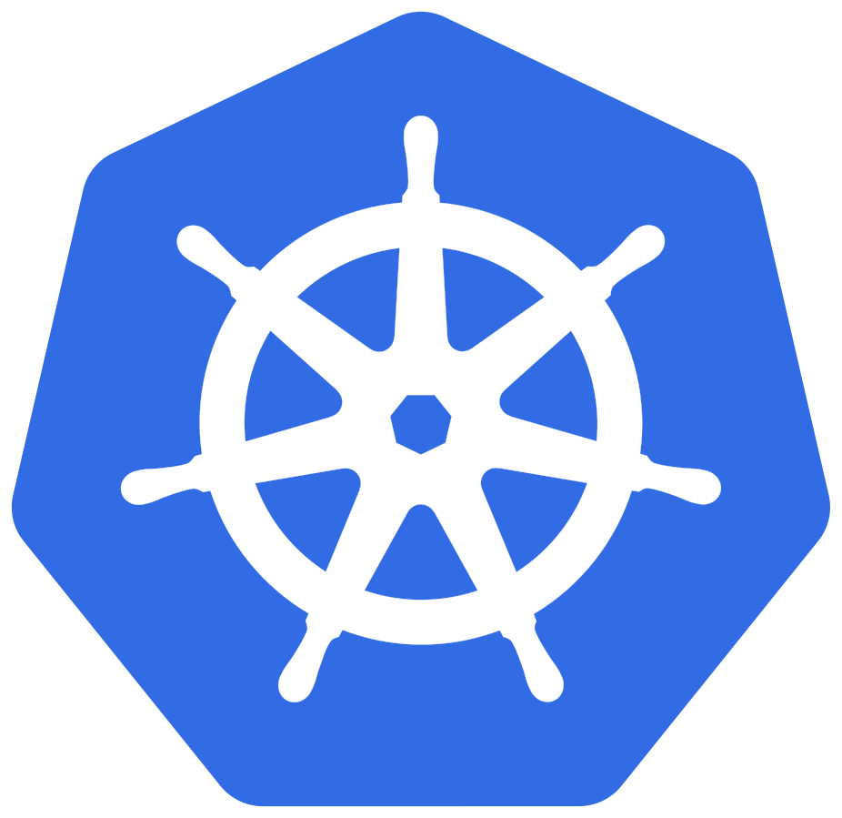
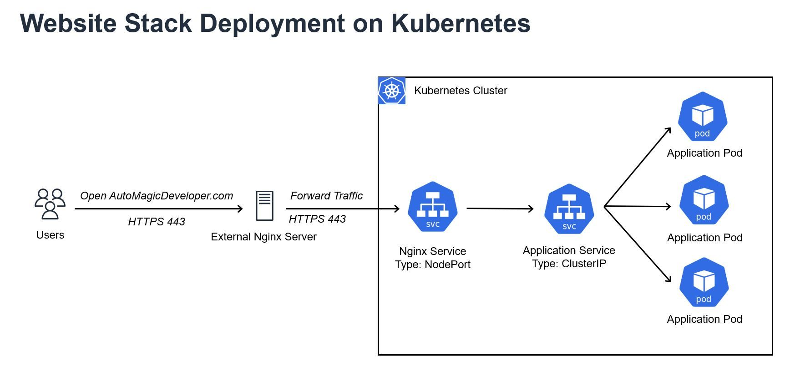
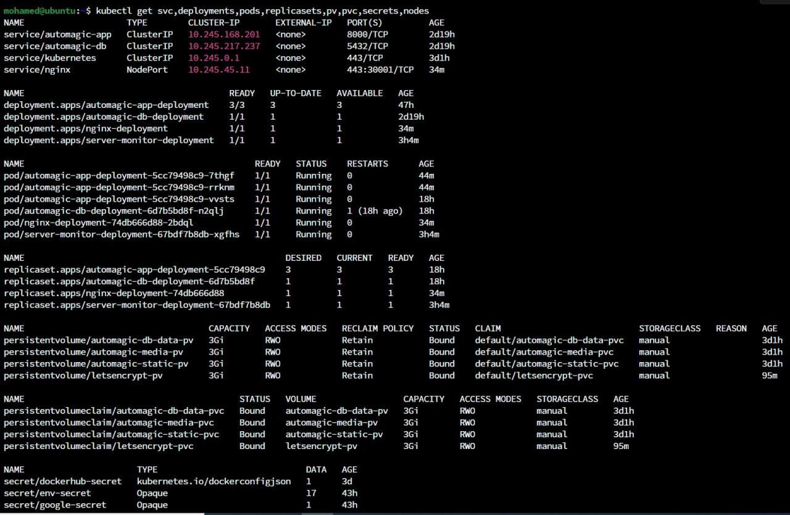

[![LinkedIn][linkedin-shield]][linkedin-url]

<!-- PROJECT LOGO -->
 

  
  <h3 align="center">Website Stack Deployment on Kubernetes</h3>

<!-- TABLE OF CONTENTS -->

  
Table of Contents

  <ol>
    <li>
      <a href="#about-the-project">About The Project</a>
      <ul>
        <li><a href="#description">Description</a></li>
        <li><a href="#tech-stack">Tech Stack</a></li>
      </ul>
    </li>
    <li><a href="#contact">Contact</a></li>
  </ol>

<!-- ABOUT THE PROJECT -->
## About The Project

* Project Name: Website Stack Deployment on Kubernetes
* Version: v1.0.0
* Organization Department: Technology

### Description

I successfully migrated my web application stack to Kubernetes while achieving a cost-effective design. Here's a breakdown of the steps I took to ensure a seamless transition:

**1. Managed Kubernetes Cluster:** Started by creating a managed Kubernetes cluster on DigitalOcean.

**2. Secrets Management:** Applied essential application secrets as environment variables.

**3. Persistent Volumes and Claims:** Designed and implemented persistent volumes (PV) and persistent volume claims (PVC) to house the database data folder, as well as the static and media folders for the application.

**4. Deployment and Services Definition:** Created deployment and service definition files for each component.

**5. Domain Configuration:** Since the Nginx Ingress service requires a load balancer which is quite expensive, I chose to deploy an external server equipped with Nginx. Then Pointed my domain name (automagicdeveloper.com) to this server. That way, I can receive the traffic on this server, and then route it to the k8s cluster.

**6. Optimized Traffic Flow:** Within the Kubernetes cluster, I orchestrated the deployment of an Nginx instance to manage the incoming traffic from the external Nginx server. Furthermore, I shared static and media volumes between the application and Nginx pods. It's essential to note that this sharing was specifically engineered to enable Nginx to serve the static and media files.

**7. Load Balancing:** Instead of using Nginx Ingress along with an expensive load balancer, I adopted a different approach. I employed a NodePort service type for the internal Nginx service, allowing efficient routing of external traffic to the internal cluster. The communication between the external and internal Nginx servers is secured using SSL.

I am Incredibly pleased with the results, and this cost-effective solution. The alternative using Nginx Ingress with a load balancer would have incurred a significant price hike—over 3 times the expense of my reverse proxy server setup.

(<a href="#readme-top">back to top</a>)

### Tech Stack

This project was developed using the following tech stack:

* Kubernetes
* Docker
* Web Development

(<a href="#readme-top">back to top</a>)

<!-- CONTACT -->
## Contact

Mohamed AbdelGawad Ibrahim - [@m-abdelgawad](https://www.linkedin.com/in/m-abdelgawad/) - <a href="tel:+201069052620">+201069052620</a>

(<a href="#readme-top">back to top</a>)

<!-- MARKDOWN LINKS & IMAGES -->
<!-- https://www.markdownguide.org/basic-syntax/#reference-style-links -->
[linkedin-shield]: https://img.shields.io/badge/-LinkedIn-black.svg?style=for-the-badge&logo=linkedin&colorB=555
[linkedin-url]: https://www.linkedin.com/in/m-abdelgawad/
